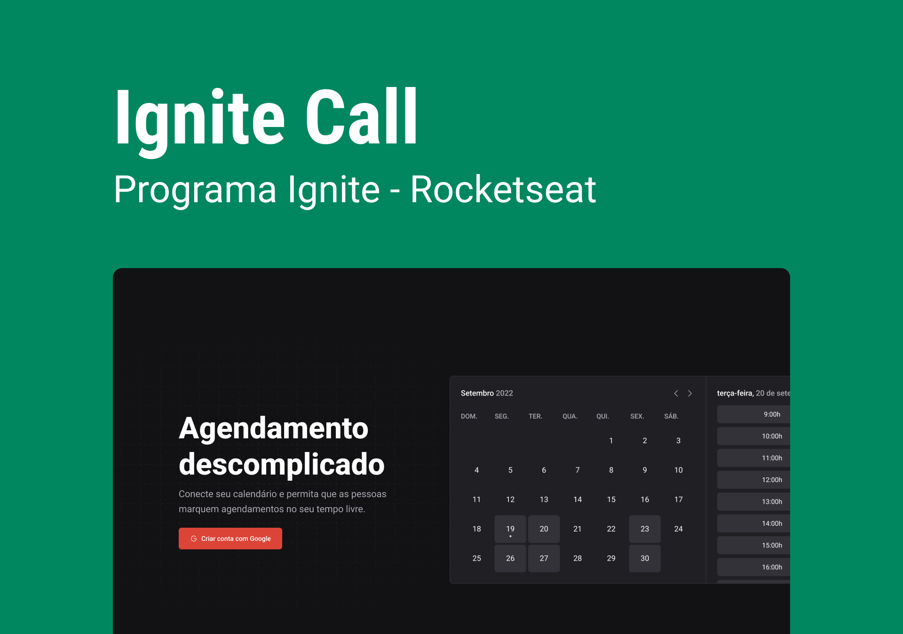

# Ignite Call

### _Rocketseat React Course's Project_

---

## Key Concepts Learned

- Nexte.js
- React Hook Form
- Zod
- Stitches
- API Routes
- Prisma
- [in progres...]

## Installation

Ignite Shop - Typescript requires [Node.js](https://nodejs.org/) v10+ to run.

Install the dependencies and devDependencies and start the server.

```sh
cd ignite-shop
npm i
npm run dev
```